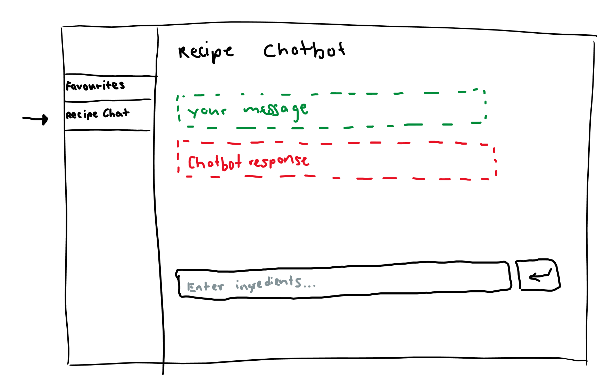
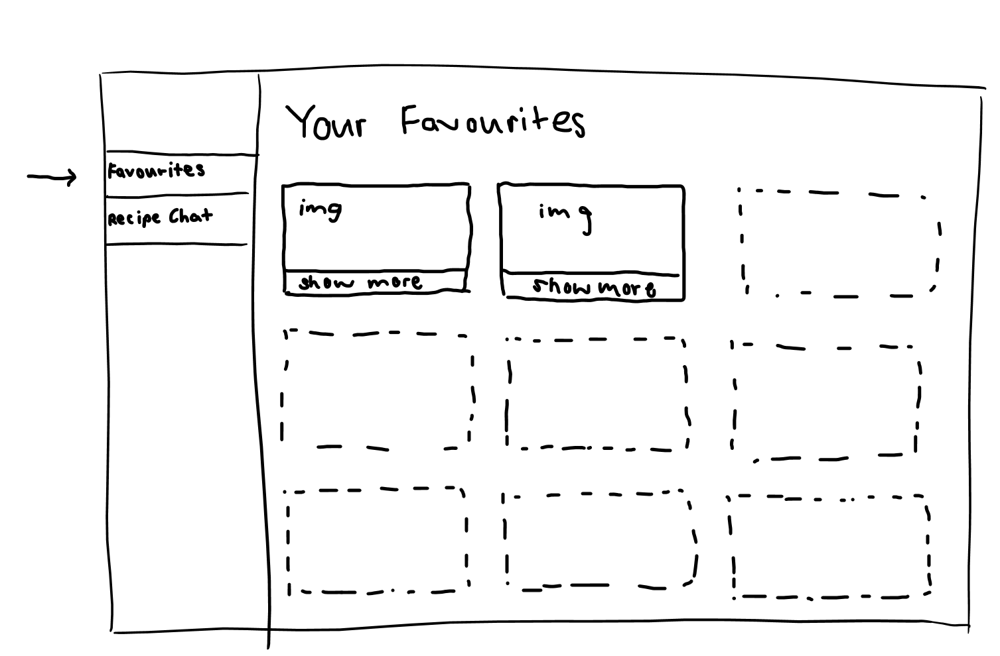
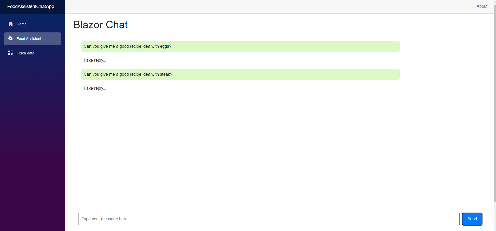
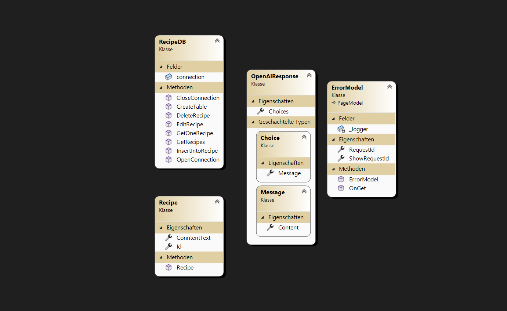
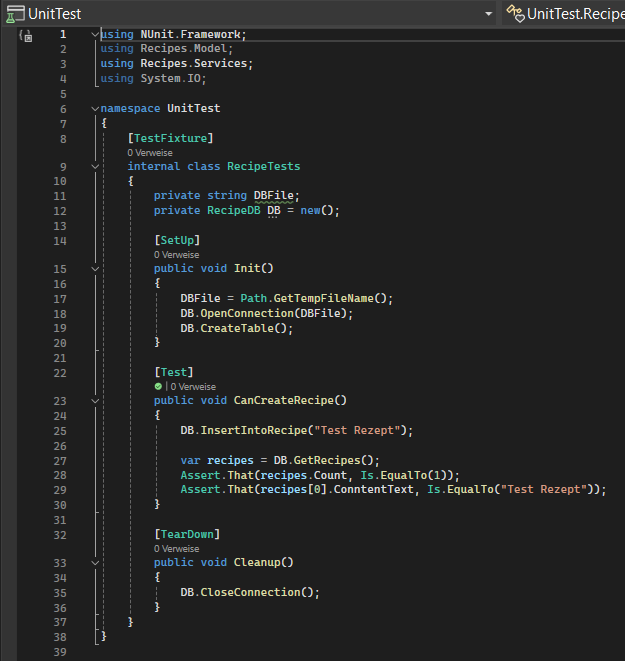
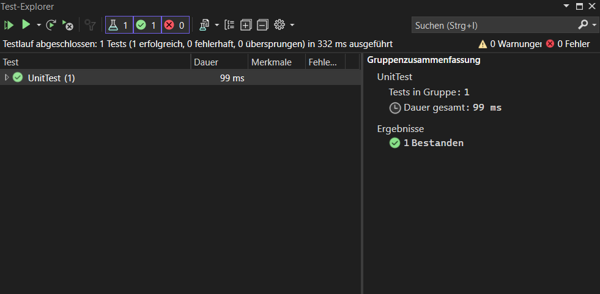

# Recipe Maker

## Fynn Piekarek, Moritz Anliker

---

# Inhaltsverzeichnis

- [Arbeitsjournal](#Arbeitsjournal)
- [Projektidee](#Projektidee)
- [Projektbeschrieb](#Projektbeschrieb)
- [Projektplanung](#Projektplanung)
- [Architektur & Designs](#Architektur--Designs)
- [Prototyp](#Prototyp)
- [Implementierung](#Implementierung)
- [Unit Test](#Unit-Test)
- [Video Präsentation](#Video-Präsentation)
- [Fazit](#Fazit)

## Arbeitsjournal

| Datum      | Dokumentation                                   |
|------------|-------------------------------------------------|
| 29.01.2024 | Projekt Start                                   |
|            | Ideen Findung und Recherchen ohne Konkretes Ergebnis. |
| 19.02.2024 | Einigung auf Projektidee                        |
|            | Einigung auf die Idee eine Blazor Plattform zu gestalten, welche Koch Rezepte durch Hilfe von KI zusammenstellt. |
| 26.02.2024 | Idee Ausarbeitung/Zielsetzung                   |
|            | Konkretisierung unserer Idee und definieren von ersten Zielen. |
| 04.03.2024 | Wie kommen wir an unser Ziel?                   |
|            | Engere Definierung von Architektur von unserer Plattform, Design Ideen Sammeln. Orientierung an Aufgabenstellung. |
| 11.03.2024 | Planung und Aufgaben Verteilung                 |
|            | Aufteilung von Aufgaben und definierten schritten. Start der Erarbeitung eines Prototyps. |
| 18.03.2024 | Arbeiten an Prototypen                          |
|            | Prototyp 1: Benutzeroberfläche (Moritz)         |
|            | Prototyp 2: OpenAI einbindung (Fynn)            |
|            | Findung eines Problems mit der Verbindung zu OpenAI. |
| 25.03.2024 | Arbeiten an Prototypen                          |
|            | Arbeit an Problem Behebung (erfolglos). Arbeit an Benutzeroberfläche. |
| 27.03.2024 | Gespräch mit Herr Lagger                        |
|            | Versuch das Problem mit der Verbindung zu beheben (erfolgslos). |
| 15.04.2024 | Arbeit an Benutzeroberfläche                    |
|            | Fynn (Krank)                                    |
| 29.04.2024 | Erfolge und Fortschritte                        |
|            | OpenAi connection konnte hergestellt werden und die API hat uns geantwortet (Moritz). |
| 06.05.2024 | Erfolge und Fortschritte                        |
|            | SQLite Datenbank Einbindung wurde erstellt (Fynn). |
| 13.05.2024 | Erfolge und Fortschritte                        |
|            | Email Funktion zur Versendung von Rezepten wurde erstellt (Fynn). |
| 20.05.2024 | Erfolge und Fortschritte                        |
|            | Seite wurde getestet (Fynn und Moritz). |
| 27.05.2024 | Erfolge und Fortschritte                        |
|            | Dokumente wie UML und ER Diagram wurden erstellt (Fynn und Moritz). |
| 03.06.2024 | Erfolge und Fortschritte                        |
|            | Unit Tests wurden erstellt und getestet (Moritz). |
| 10.06.2024 | Abschluss der Arbeiten                          |
|            | Fertigstellung und letzte Tests. |
| 14.06.2024 | Präsentation und Dokumentation                  |
|            | Abschlusspräsentation und Abgabe der Projektdokumentation

## Projektidee

Unsere Projektidee besteht darin, eine Webanwendung zu entwickeln, die es den Benutzern ermöglicht, Rezepte basierend auf den Zutaten zu generieren, die sie bereits zu Hause haben. Das Ziel ist es, eine praktische Lösung anzubieten, um Mahlzeiten zuzubereiten, ohne zusätzliche Zutaten kaufen zu müssen. Die Anwendung soll Benutzern helfen, schnell Ihr passendes Rezept zu finden.

## Projektbeschrieb

Das Projekt umfasst die Entwicklung einer Webanwendung mit einer einfachen Benutzeroberfläche, die mit Blazor erstellt wird. Benutzer geben ihre vorhandenen Zutaten manuell, in einer Leiste ein. Basierend auf diesen eingegebenen Zutaten generiert die Anwendung eine Liste von Rezepten, die diese Zutaten verwenden. Die Rezepte werden nach Relevanz sortiert, um die am besten passenden Optionen anzuzeigen.

Technisch gesehen wird die Webanwendung mithilfe von Blazor entwickelt. Um die Zutaten- und Rezeptdaten zu speichern und abzurufen, wird eine Datenbank verwendet. Diese Datenbank kann beispielsweise eine einfache SQL-Datenbank oder eine NoSQL-Datenbank wie MongoDB sein. Die Anwendung kommuniziert mit der Datenbank über HTTP-Anfragen, um Zutaten und Rezepte zu speichern und abzurufen.

## Projektplanung

| Datum      | Aktivität                              |
|------------|----------------------------------------|
| 29.01.2024 | Projekt Idee Findung                   |
| 19.02.2024 | Einigung auf Idee und Recherchieren    |
| 26.02.2024 | Zielsetzung und Ausarbeitung der Idee |
| 04.03.2024 | Schritte zum Ziel planen               |
| 11.03.2024 | Aufgaben Verteilung                    |
| 18.03.2024 | Start Arbeit an einem Prototyp         |
| 25.03.2024 | Arbeit an Prototyp                     |
| 15.04.2024 | Arbeit an Prototyp                     |
| 29.04.2024 | Arbeit an Prototyp                     |
| 06.05.2024 | Reflektieren/Testing/Analysieren der Arbeit an Prototypen |
| 13.05.2024 | Ausarbeitung von Prototypen            |
| 20.05.2024 | Aufbau des Projektes                   |
| 27.05.2024 | Aufbau des Projektes                   |
| 03.06.2024 | Fertigstellung des Projektes           |
| 10.06.2024 | Testing und letzte Anpassungen         |
| 17.06.2024 | Abgabe                                 |

## Architektur & Designs

## Prototyp

Hier sehen Sie den ersten von uns entwickelten Prototyp.

## Implementierung

Wir haben uns entschieden, den ursprünglichen Prototyp zu verwerfen, da unser aktuelles Design übersichtlicher und benutzerfreundlicher ist. Die neue Version bietet eine klarere Struktur, wodurch die Bedienung erleichtert wird. Durch diese Verbesserungen können Nutzer nun effizienter auf die gewünschten Funktionen zugreifen und eine insgesamt bessere Benutzererfahrung genießen.
<table>
  <tr>
    <td></td>
    <td></td>
  </tr>
</table>

## Unit Test

Dieser Unit Test prüft die `RecipeDB`-Klasse. Er besteht aus drei Teilen:

1. **Setup-Methode (`Init`)**: Erstellt eine temporäre Datenbank, öffnet die Verbindung und erstellt die Tabellen.
2. **Test-Methode (`CanCreateRecipe`)**: Fügt ein Rezept mit dem Text "Test Rezept" in die Datenbank ein, ruft alle Rezepte ab und überprüft, ob das eingefügte Rezept korrekt gespeichert wurde.
3. **TearDown-Methode (`Cleanup`)**: Schließt die Datenbankverbindung nach jedem Test.

Der Test stellt sicher, dass Rezepte korrekt in die Datenbank eingefügt und abgerufen werden können.

## Video Präsentation

Hier ist unsere Video-Präsentation zu dem Blazor-Projekt.

[Video Präsentation: Fynn_Moritz_Projektpresentation.mp4](./Fynn_Moritz_Projektpresentation.mp4)

## Fazit zu unserem Blazor Projekt

Unser Projekt hat uns viele neue Erkenntnisse gebracht. Die erfolgreiche Integration der OpenAI API war ein wichtiger Fortschritt. Wir haben gelernt, API-Verbindungen effektiv zu nutzen und eine SQLite-Datenbank zu implementieren.

Wir erstellten zudem eine Funktion zur automatisierten Rezeptversendung per Email und lernten viel über die Bedeutung gründlicher Planung und Dokumentation durch UML, ER Diagramme und Unit Tests.

Einige Herausforderungen, wie Probleme mit der OpenAI-Verbindung und Krankheitsausfälle, kosteten Zeit und zeigten uns die Notwendigkeit früher Tests und besserer Kommunikation. Trotz dieser Hindernisse konnten wir unsere Ziele erreichen und eine funktionierende Plattform erstellen. Wir sind stolz auf die erzielten Fortschritte und die gesammelten Erfahrungen.

